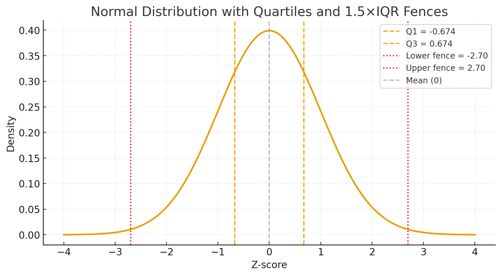

# why some boxplots used 1.5IQR as the whisker?

Boxplots use **1.5 × IQR** for the whiskers as a **rule of thumb** to spot potential outliers. 

## Step-by-step:
1. **IQR (Interquartile Range)** = Q3 − Q1
   → It measures the spread of the middle 50% of the data.
2. **Whiskers** extend from the box to:
   * **Lower bound:** Q1 − 1.5 × IQR
   * **Upper bound:** Q3 + 1.5 × IQR
3. **Any points beyond those bounds** are plotted individually as *possible outliers*.

## Why 1.5?

### 1. The origin

The **1.5×IQR** rule comes from **[John Tukey](https://en.wikipedia.org/wiki/John_Tukey)**, who introduced the boxplot in the 1970s.
He wanted a simple, **distribution-free** way to flag unusually distant values, a robust, nonparametric outlier rule that works without assuming normality.

---
### 2. The reasoning behind 1.5

For a **normal distribution**:

* `Q1 ≈ −0.675 σ`  --> check the standard normal distribution table for z0.25 (probability 0.25) --> the z value is -0.675.
* `Q3 ≈ +0.675 σ`  --> check the standard normal distribution table for z0.75 (probability 0.75) --> the z value is 0.675. 
* therefore, `IQR = Q3 − Q1 ≈ 1.349 σ`.

If `IQR ≈ 1.349 σ` then, `1.5 × IQR ≈ 2.024 σ`

That means the **“fences”** are roughly **2 standard deviations** beyond the median (in each direction).

Check the [68-95-99.7 rule](https://github.com/erikaris/301/blob/main/norm_dist_68_95_99_rule.md). In a normal distribution, about **95%%** of data lie beyond ±2 σ from the mean. 
Thus, 1.5 × IQR catches genuinely rare values, but doesn’t overreact.

---

### 3. Why not 2 × IQR or 1 × IQR?

* **1×IQR** → too tight → flags too many points as outliers.
* **2×IQR** → too loose → misses some meaningful extremes.
  **Tukey** found **1.5** to be a good empirical compromise — robust for many distributions.

He also proposed **3×IQR** for “extreme” outliers (like a 3 σ rule).

---

**In summary:**

> The 1.5×IQR rule was chosen because it’s a balance:
  * Not too tight (doesn’t label normal variation as outliers).
  * Not too loose (still catches extreme values).
  * Statistically, for roughly bell-shaped data, this range covers about **95%** of the data. So anything outside can be considered unusual/outlier.

### 4. Check this normal curve for a better understanding. 

Here’s the visual explanation:

* The **orange dashed lines** show **Q1 (−0.674)** and **Q3 (+0.674)** — the 25th and 75th percentiles of a normal distribution.
* The **red dotted lines** mark the **1.5 × IQR fences**, roughly at ±2.7σ.
* Only a tiny fraction of the normal curve lies beyond those fences — those would be considered *outliers* in Tukey’s boxplot rule.

This demonstrates visually where that **1.5 × IQR** idea comes from and why it corresponds to about **2 standard deviations** beyond the center for normally distributed data.

