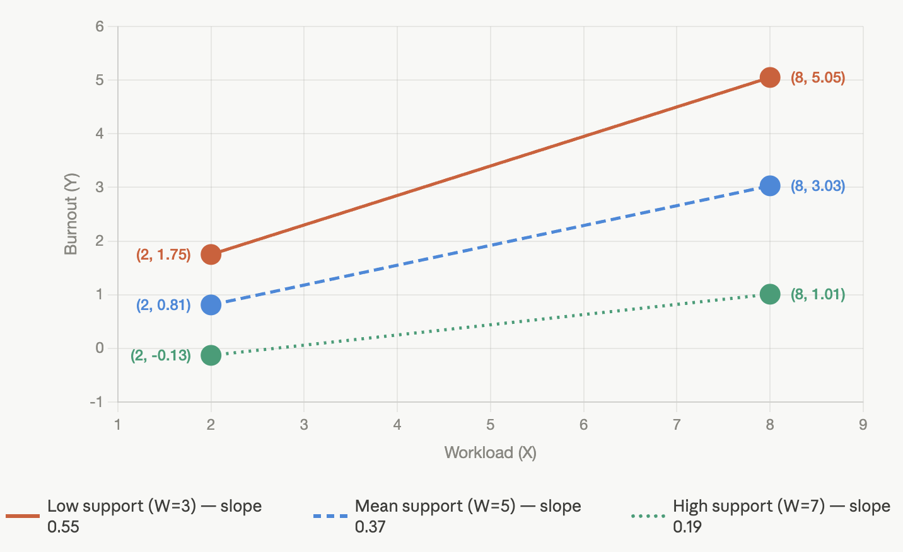
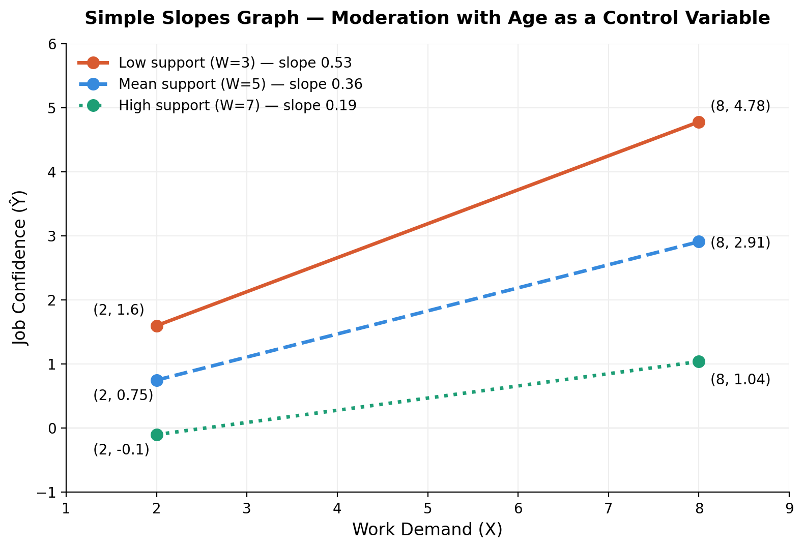

# Mediation, Moderation, & Factor Analysis
---

## Overview

This guide uses a single running example — a workplace wellbeing study — throughout all three topics.

**Topics covered:**
1. Mediation vs moderation — what question each one is asking, and how they differ
2. Moderation analysis — how to run it, read the SPSS output, and answer your assignment questions
3. Factor analysis — how to understand each section of the SPSS output

---

## The Dummy Dataset: Workplace Wellbeing Study

**Scenario:** A researcher surveys 150 employees. The research question is: *does high workload lead to burnout, and does social support change that relationship?*

**Variables:**

| Variable | Role | Scale |
|---|---|---|
| Workload | X — the predictor | 1–10 (1 = very low, 10 = very high) |
| Social Support | W — the moderator | 1–10 (1 = no support, 10 = very high support) |
| Burnout | Y — the outcome | 1–10 (1 = not burned out, 10 = completely burned out) |
| Coping Ability | M — used only in the mediation example | 1–10 (1 = very poor, 10 = very good) |

**Ten sample rows (full dataset n = 150):**

| Participant | Workload (X) | Social Support (W) | Coping (M) | Burnout (Y) |
|---|---|---|---|---|
| 1 | 8 | 2 | 3 | 8 |
| 2 | 6 | 4 | 5 | 6 |
| 3 | 9 | 1 | 2 | 9 |
| 4 | 4 | 8 | 7 | 3 |
| 5 | 7 | 3 | 4 | 7 |
| 6 | 3 | 9 | 8 | 2 |
| 7 | 8 | 5 | 3 | 7 |
| 8 | 5 | 6 | 6 | 4 |
| 9 | 9 | 2 | 2 | 9 |
| 10 | 2 | 10 | 9 | 1 |

**Pattern to notice:** High workload + low social support consistently goes with high burnout. People with high support seem protected even when workload is high. This is exactly what moderation captures.

---

## Part A: Mediation vs Moderation — What Is the Difference?

These two are very commonly confused because both involve three variables. The difference is entirely in the **question you are asking**.

A useful way to remember it:
- **Mediation** asks *why* — it is about explaining a mechanism
- **Moderation** asks *when* or *for whom* — it is about identifying conditions

---

### The comparison, step by step

Rather than a dense table, here is the comparison broken into plain questions.

---

**1. What is the core question?**

| | |
|---|---|
| **Mediation** | *Why* does X lead to Y? What is happening in between? |
| **Moderation** | *Does the effect of X on Y change depending on a third variable?* |

---

**2. What does the third variable actually do?**

| | |
|---|---|
| **Mediation** | The third variable M **carries** the effect. X first affects M, and M then affects Y. M is a stepping stone. |
| **Moderation** | The third variable W **changes the strength** of the effect. It does not sit in between X and Y — it sits alongside and turns the dial up or down. |

---

**3. Where does the third variable sit in the diagram?**

**Mediation — M sits in the middle:**

```
X ──────────────────────────────► Y
(Workload)    direct effect    (Burnout)
     │                              ▲
     └──► Coping (M) ──────────────┘
            indirect effect
```

**Moderation — W sits above, changing the arrow:**

```
         Social Support (W)
                │
                │ makes arrow stronger or weaker
                ▼
X ══════════════════════════════► Y
(Workload)                     (Burnout)
```

---

**4. What exactly are you testing?**

| | |
|---|---|
| **Mediation** | Whether the indirect path (X → M → Y) is statistically significant |
| **Moderation** | Whether the interaction term (X × W) in the regression is statistically significant |

---

**5. Research question examples using our dummy dataset**

This is where the difference becomes most concrete. Same variables, completely different questions:

| | Mediation | Moderation |
|---|---|---|
| **Research question** | Does workload lead to burnout *because* it wears down employees' ability to cope? | Does workload lead to burnout, and is this effect *worse for employees with low social support*? |
| **What you are claiming** | Coping is the *reason why* workload causes burnout — it is the pathway | Social support *changes how strongly* workload causes burnout — it is a condition |
| **Third variable** | Coping (M) — it explains the mechanism | Social Support (W) — it sets the condition |
| **If true, it means...** | Remove the workload, coping recovers, and burnout drops. The effect *travels through* coping. | Give employees more social support and the damage of workload on burnout is reduced. The relationship between X and Y itself changes. |
| **Diagram** | X → Coping → Y | W sitting above the X → Y arrow, changing its slope |

---

**6. One-line summary**

> **Mediation:** "Workload causes burnout *because* it destroys coping ability."
>
> **Moderation:** "Workload causes burnout, *but less so* when social support is high."

---

## Part B: Moderation Analysis

### What moderation is testing

We are testing whether social support (W) moderates the relationship between workload (X) and burnout (Y).

In plain English: *is the effect of workload on burnout different depending on how much social support someone has?*

We test this by adding an **interaction term** — workload multiplied by social support — to the regression model. If this term is significant, moderation is confirmed.

---

### The moderation equation

> **Ŷ = b₀ + b₁X + b₂W + b₃(X × W)**

| Term | Name | What it means |
|---|---|---|
| b₀ | Intercept (Constant) | Predicted burnout when workload = 0 and social support = 0 |
| b₁ | Slope for X | Effect of workload on burnout when social support = 0 |
| b₂ | Slope for W | Effect of social support on burnout when workload = 0 |
| b₃ | Interaction term | How much the slope of X changes for each 1-unit increase in W |

b₃ is the key number. It tells you whether moderation exists.

---

### How to run moderation in SPSS

**If you have the PROCESS macro (Hayes):**

```
Analyze → Regression → PROCESS (by Andrew Hayes)
  Y (outcome):     Burnout
  X (predictor):   Workload
  W (moderator):   Social Support
  Model number:    1
  Options: tick "Generate data for visualising interactions"
  Options: tick "Plot interactions"
  Click OK
```

**If you do not have PROCESS — manual method:**

```
Step 1: Compute the interaction term
  Transform → Compute Variable
  Target Variable: Workload_x_Support
  Numeric Expression: Workload * Social_Support
  Click OK

Step 2: Run the regression
  Analyze → Regression → Linear
  Dependent: Burnout
  Independent(s): Workload, Social_Support, Workload_x_Support
  Click OK
```

---

### Q1: How do you calculate intercept and slope values from SPSS output?

After running the analysis, SPSS produces a **Coefficients table**. Here is what ours looks like:

```
─────────────────────────────────────────────────────────────────────
Outcome variable: Burnout (Y)

Model Summary
R = .87    R² = .76    F(3, 146) = 153.40    p < .001
─────────────────────────────────────────────────────────────────────
Coefficients

                              B        SE        t        p
─────────────────────────────────────────────────────────────────────
(Constant)                 1.52      0.41      3.71    <.001
Workload (X)               0.82      0.07     11.71    <.001
Social Support (W)        −0.29      0.06     −4.83    <.001
Workload × Support        −0.09      0.01     −9.00    <.001
─────────────────────────────────────────────────────────────────────
```

**How to extract each value:**

| Value | Where to look in SPSS | Our number |
|---|---|---|
| b₀ — intercept | (Constant) row → B column | **1.52** |
| b₁ — slope for X | Workload row → B column | **0.82** |
| b₂ — slope for W | Social Support row → B column | **−0.29** |
| b₃ — interaction | Workload × Support row → B column | **−0.09** |

**The full equation:**

> Ŷ = 1.52 + 0.82(Workload) − 0.29(Support) − 0.09(Workload × Support)

---

### Interpreting the output

**Does moderation exist?**

Look at the interaction term row:
- b₃ = −0.09, p < .001
- The p-value is below .05, so **yes, moderation is confirmed**

**What does b₃ = −0.09 mean?**

For every 1-point increase in social support, the slope of workload on burnout decreases by 0.09. In other words, higher support gradually weakens how much workload drives burnout. Social support is buffering the effect.

**What does the overall model tell us?**

- R² = .76 — the model explains 76% of the variance in burnout
- The model is significant: F(3, 146) = 153.40, p < .001

---

### Q2: How do you sketch a simple slopes graph?

A simple slopes graph shows the X → Y relationship at three levels of W (low, mean, high). Each level becomes one line on the graph. Diverging lines confirm the interaction visually.

---

**Step 1: Get the mean and SD of W from SPSS**

```
Analyze → Descriptive Statistics → Descriptives
  Move Social Support into the Variables box
  Click OK
```

From the output:
> Mean of W (Social Support) = 5.0,  SD = 2.0

---

**Step 2: Define the three levels of W**

| Level | Calculation | Value |
|---|---|---|
| Low W | Mean − 1 SD | 5.0 − 2.0 = **3.0** |
| Mean W | Mean | **5.0** |
| High W | Mean + 1 SD | 5.0 + 2.0 = **7.0** |

---

**Step 3: Substitute each W value into the equation and simplify**

Take the full equation: Ŷ = 1.52 + 0.82X − 0.29W − 0.09(X × W)

Plug in each W value and collect terms in X:

**Low support (W = 3.0):**
```
Ŷ = 1.52 + 0.82X − 0.29(3) − 0.09X(3)
  = 1.52 − 0.87 + (0.82 − 0.27)X
  = 0.65 + 0.55X
```

**Mean support (W = 5.0):**
```
Ŷ = 1.52 + 0.82X − 0.29(5) − 0.09X(5)
  = 1.52 − 1.45 + (0.82 − 0.45)X
  = 0.07 + 0.37X
```

**High support (W = 7.0):**
```
Ŷ = 1.52 + 0.82X − 0.29(7) − 0.09X(7)
  = 1.52 − 2.03 + (0.82 − 0.63)X
  = −0.51 + 0.19X
```

Each simplified equation is now one line on the graph.

---

**Step 4: Calculate plotting points**

Pick two X values — one low, one high. Use X = 2 and X = 8.

| W Level | X = 2 (low workload) | X = 8 (high workload) | Slope |
|---|---|---|---|
| Low Support (W = 3) | 0.65 + 0.55(2) = **1.75** | 0.65 + 0.55(8) = **5.05** | 0.55 |
| Mean Support (W = 5) | 0.07 + 0.37(2) = **0.81** | 0.07 + 0.37(8) = **3.03** | 0.37 |
| High Support (W = 7) | −0.51 + 0.19(2) = **−0.13** | −0.51 + 0.19(8) = **1.01** | 0.19 |

---

**Step 5: Plot the graph**

- X-axis: Workload (your predictor)
- Y-axis: Burnout (your outcome)
- Draw one line per row in the table above, using your two points
- Label each line by support level




---

**Step 6: Interpret the graph**

- All three lines slope upward — workload increases burnout at every level of support
- But the slopes differ: **steeper = stronger effect**
  - Low support: slope = 0.55 (workload has the biggest effect on burnout)
  - Mean support: slope = 0.37
  - High support: slope = 0.19 (workload has the smallest effect on burnout)
- The lines diverge — they fan out — which is the visual signature of an interaction effect

> **Conclusion:** Social support moderates the relationship between workload and burnout. When support is high, burnout stays relatively low even at high workloads. When support is low, burnout rises sharply as workload increases. This matches what b₃ = −0.09 told us numerically.

---

### Shortcut: PROCESS output

If you ticked "Generate data for visualising interactions" in PROCESS, the output will include a ready-made table:

```
Data for visualising the conditional effect of X on Y

W (Social Support)   X (Workload)   Ŷ (Burnout)
       3.00               2            1.75
       3.00               8            5.05
       5.00               2            0.81
       5.00               8            3.03
       7.00               2           −0.13
       7.00               8            1.01
```

These are exactly the numbers from Step 4 above — PROCESS calculated them automatically. You can paste this table straight into Excel and plot without any manual calculation.

---
## Part B (Extended): Moderation with a Control Variable (e.g., Age)

### What is a control variable?

A control variable (also called a covariate) is a variable included in the model not because it is theoretically interesting, but to rule out its influence on the results. For example, age might independently affect job confidence — older employees might simply report higher confidence regardless of workload or support. By including age as a control, you ensure that the moderation effect you find is not just a hidden effect of age.

Control variables are different from moderators:

| | Control variable | Moderator (W) |
|---|---|---|
| Why included | To remove its confounding influence | To test whether it changes the X → Y relationship |
| Interacts with X? | No | Yes |
| Theoretically interesting? | Not the focus | Yes — it is a key variable |
| Where in PROCESS | COV box | W box |

---

### How it changes the full equation

Without a control variable:
> Ŷ = b₀ + b₁X + b₂W + b₃(X × W)

With age as a control variable:
> Ŷ = b₀ + b₁X + b₂W + b₃(X × W) + b₄(Age)

Age simply gets its own term and coefficient (b₄). That is the only change to the equation structure. If there were two control variables, there would be two extra terms (b₄C₁ + b₅C₂), and so on.

---

### How to add it in SPSS PROCESS

```
Analyze → Regression → PROCESS v5.0 by Andrew Hayes
  Y: Job Confidence
  X: Work Demand
  W: Social Support
  COV: Age          ← add control variable here
  Model: 1
  Click OK
```

---

### How the SPSS output will look

The Coefficients table now has an extra row for Age:

```
─────────────────────────────────────────────────────────────────────
Outcome variable: Job Confidence (Y)

Model Summary
R = .89    R² = .79    F(4, 145) = 136.80    p < .001
─────────────────────────────────────────────────────────────────────
Coefficients

                              B        SE        t        p
─────────────────────────────────────────────────────────────────────
(Constant)                 1.38      0.43      3.21    .002
Work Demand (X)            0.80      0.07     11.43    <.001
Social Support (W)        −0.28      0.06     −4.67    <.001
Work Demand × Support     −0.09      0.01     −9.00    <.001
Age                        0.03      0.01      3.00    .003
─────────────────────────────────────────────────────────────────────
```

Notice R² increased slightly from .76 to .79 — age explains a small additional portion of variance in job confidence.

---

### How to extract intercept and slopes

You read the table in exactly the same way as before. The only addition is b₄ for age:

| Value | Row in SPSS | Our number |
|---|---|---|
| b₀ — intercept | (Constant) | **1.38** |
| b₁ — slope for X | Work Demand | **0.80** |
| b₂ — slope for W | Social Support | **−0.28** |
| b₃ — interaction | Work Demand × Support | **−0.09** |
| b₄ — control | Age | **0.03** |

**Full equation:**
> Ŷ = 1.38 + 0.80(Work Demand) − 0.28(Support) − 0.09(Work Demand × Support) + 0.03(Age)

---

### How to calculate the sub-equations for low, mean, and high W

This step is **identical to before**. Age does not appear here because when plotting the moderation effect, age is held constant at its mean — which the model already handles automatically in the background.

You only substitute values for W (and later X). Age plays no active role in this step.

Using the same W values as before (Low = 3, Mean = 5, High = 7):

**Low support (W = 3):**
```
Ŷ = 1.38 + 0.80X − 0.28(3) − 0.09X(3) + 0.03(Age)
  = 1.38 − 0.84 + (0.80 − 0.27)X + 0.03(Age)
  = 0.54 + 0.53X + 0.03(Age)
```

Since age is held constant, it folds into the intercept. It shifts the line up or down slightly but does not change the slope:
```
  ≈ 0.54 + 0.53X     (age absorbed into the constant)
```

**Mean support (W = 5):**
```
Ŷ ≈ 0.03 + 0.36X
```

**High support (W = 7):**
```
Ŷ ≈ −0.48 + 0.19X
```

> The slopes (0.53, 0.36, 0.19) are very close to the original model (0.55, 0.37, 0.19). This is typical — adding a control variable makes small adjustments to the estimates but rarely changes the overall pattern.

---

> ** Note: Two separate things happen when a control variable is added — don't mix them up**
>
> It is easy to assume that "the control variable doesn't affect the model" — but that is only true for one specific step. There are actually two separate stages, and the control variable behaves differently in each:
>
> **Stage 1 — Running the regression (estimating b₀, b₁, b₂, b₃).** Here, the control variable *does* change things. All coefficients in a regression are estimated simultaneously, accounting for every variable in the model at once. Adding a new variable (e.g. age) means the model now has to redistribute the variance in Y across all predictors together — so b₀, b₁, b₂, and b₃ will all shift slightly compared to the model without age, even though age itself is not part of the interaction. This is normal behaviour in regression, not an error.
>
> **Stage 2 — Calculating the simple slopes for low, mean, and high W (after the regression has already been run).** Here, the control variable is held constant at its mean. The variable being plotted (X) and the variable being probed (W) are deliberately varied to reveal the interaction pattern. Any other variable in the model needs to be fixed at a single, representative value, otherwise it would introduce unwanted variation into the prediction — and the mean is the most defensible "typical" value to use.
>
> This is not an arbitrary convention — it is standard practice in the moderation analysis literature. When other variables (such as demographic covariates) are included in a moderation model, the simple slopes are calculated holding those covariates at their mean (or, equivalently, a value of zero if the covariate has been mean-centred beforehand).
>
> Holding the control variable at its mean in Stage 2 affects the **intercepts** of the simple slopes lines but not their **slopes**. This is why, in the example above, the slopes barely changed (0.55 → 0.53, 0.37 → 0.36, 0.19 → 0.19) while the intercepts shifted a little more — the small shift in slopes is a Stage 1 effect (the new regression), while the intercept-only shift during the substitution step is the Stage 2 effect (holding age constant).
>
> **References:** Aiken, L. S., & West, S. G. (1991). *Multiple Regression: Testing and Interpreting Interactions.* Sage. Hayes, A. F. (2022). *Introduction to Mediation, Moderation, and Conditional Process Analysis* (3rd ed.). Guilford Press.

---

### How the line graph looks

The graph looks almost identical to the version without a control variable — still three lines, still the same axes, still the same diverging pattern. The only difference is that the lines may shift very slightly up or down due to the adjusted intercept values.

| W Level | X = 2 | X = 8 | Slope |
|---|---|---|---|
| Low Support (W = 3) | 0.54 + 0.53(2) = **1.60** | 0.54 + 0.53(8) = **4.78** | 0.53 |
| Mean Support (W = 5) | 0.03 + 0.36(2) = **0.75** | 0.03 + 0.36(8) = **2.91** | 0.36 |
| High Support (W = 7) | −0.48 + 0.19(2) = **−0.10** | −0.48 + 0.19(8) = **1.04** | 0.19 |

The three lines still diverge as workload increases. The interpretation remains the same: social support buffers the effect of work demand on job confidence, even after controlling for age.



> **Key takeaway:** Adding a control variable does not change *how* you construct the equation, extract the slopes, calculate the W levels, or draw the graph. It only adds one extra row to the Coefficients table and one extra term in the equation — which you then set aside when doing the simple slopes steps.

---

---

## Part C: Factor Analysis Output

### What is factor analysis?

Factor analysis looks at a set of measured variables (e.g., survey items) and asks: do some of these cluster together, suggesting they are all measuring the same underlying construct (a **factor**)?

**Our example:** The workplace wellbeing survey included 8 attitude items. We want to know whether they group into meaningful factors.

**The 8 items:**

| Item | Question |
|---|---|
| Item 1 | "I feel enthusiastic about my work" |
| Item 2 | "I am absorbed in what I do at work" |
| Item 3 | "Time flies when I am working" |
| Item 4 | "I feel energised by my job" |
| Item 5 | "I can decide how to do my work" |
| Item 6 | "I have freedom to organise my tasks" |
| Item 7 | "I am in control of my workload" |
| Item 8 | "I can make my own decisions at work" |

---

### How to run factor analysis in SPSS

```
Analyze → Dimension Reduction → Factor

Move all 8 items into the Variables box

Extraction tab:
  Method: Principal Components
  Extract based on: Eigenvalues over 1
  Tick: Scree plot

Rotation tab:
  Method: Varimax
  Tick: Rotated solution

Options tab:
  Tick: Suppress small coefficients
  Absolute value below: 0.30

Click OK
```

---

### Q3: How do you understand the key components of the SPSS output?

---

#### Section 1: KMO and Bartlett's Test — *Is factor analysis appropriate?*

```
─────────────────────────────────────────────────────────
KMO and Bartlett's Test

Kaiser-Meyer-Olkin Measure of Sampling Adequacy    .847

Bartlett's Test of Sphericity
  Approx. Chi-Square                              634.21
  df                                                  28
  Sig.                                             <.001
─────────────────────────────────────────────────────────
```

| Statistic | Our value | What to look for | Verdict |
|---|---|---|---|
| KMO | .847 | > .60 (ideally > .80) | ✓ Excellent |
| Bartlett's Sig. | < .001 | Must be < .05 | ✓ Pass |

Think of this as a green light before you trust anything else in the output. Both must pass for factor analysis to be appropriate.

---

#### Section 2: Communalities — *How well is each item captured?*

```
─────────────────────────────────────────────────────
Communalities

                          Initial    Extraction
Item 1 (enthusiastic)     1.000        .812
Item 2 (absorbed)         1.000        .791
Item 3 (time flies)       1.000        .763
Item 4 (energised)        1.000        .834
Item 5 (decide how)       1.000        .808
Item 6 (free to org.)     1.000        .779
Item 7 (in control)       1.000        .821
Item 8 (own decisions)    1.000        .796
─────────────────────────────────────────────────────
```

The **Extraction** column is what matters. It shows how much of each item's variance is explained by the extracted factors.

- All values here range from .76 to .83 — all well above .30
- If a value were below .30, that item is poorly represented and may need to be dropped

> ✓ All items are well captured by the solution.

---

#### Section 3: Total Variance Explained — *How many factors to keep?*

```
─────────────────────────────────────────────────────────────────────
Total Variance Explained

Component   Eigenvalue   % of Variance   Cumulative %
    1          4.21          52.6            52.6
    2          1.98          24.8            77.4
    3          0.43           5.4            82.8
    4          0.31           3.9            86.7
    5          0.27           3.4            90.1
   ...
─────────────────────────────────────────────────────────────────────
```

**How to read this:**

| Component | Eigenvalue | Retain? | Reason |
|---|---|---|---|
| 1 | 4.21 | ✓ Yes | Above 1 |
| 2 | 1.98 | ✓ Yes | Above 1 |
| 3 | 0.43 | ✗ No | Below 1 |

Two factors retained. Together they explain **77.4% of total variance** — very good.

> The rule of thumb (eigenvalue > 1) is called the **Kaiser criterion**. Use it together with the scree plot — if they agree, you can be confident.

---

#### Section 4: Scree Plot — *Visual check on how many factors to keep*

```
Eigenvalue
  4.5 |
      | *
  4.0 |
      |
  3.0 |
      |
  2.0 |   *
      |      \
  1.0 |        * ─ ─ ─ ─ ─ ─ ─ (levels off here)
      |
  0.0 +─────────────────────────────────→ Component
          1    2    3    4    5    6
```

Look for the **elbow** — the point where the line sharply changes direction and flattens out. Everything above the elbow is retained.

Here the elbow is between components 2 and 3. Retain 2 factors.

> ✓ Scree plot agrees with the Kaiser criterion. Retain 2 factors.

---

#### Section 5: Rotated Component Matrix — *The most important table*

```
─────────────────────────────────────────────────────────
Rotated Component Matrix

                          Component 1   Component 2
Item 1 (enthusiastic)        .887
Item 2 (absorbed)            .874
Item 3 (time flies)          .856
Item 4 (energised)           .902
Item 5 (decide how)                         .884
Item 6 (free to org.)                       .867
Item 7 (in control)                         .893
Item 8 (own decisions)                      .878

(Loadings below .30 suppressed)
─────────────────────────────────────────────────────────
```

**How to read this:**

- Each number is a **factor loading** — the correlation between that item and that factor
- Loadings of |.40| or above are typically considered meaningful
- Items 1–4 load strongly on Component 1 only
- Items 5–8 load strongly on Component 2 only
- This is a very clean pattern — each item belongs clearly to one factor

**To name the factors**, look at what the high-loading items have in common:
- Component 1 — enthusiasm, absorption, energy, time flying → **Work Engagement**
- Component 2 — freedom to decide, organise, control → **Job Autonomy**

> ✓ Two clean factors: Work Engagement (items 1–4) and Job Autonomy (items 5–8).

---

#### What to report from factor analysis

| What | Example write-up |
|---|---|
| KMO | KMO = .847, indicating excellent sampling adequacy |
| Bartlett's test | χ²(28) = 634.21, p < .001, confirming sufficient intercorrelations |
| Number of factors | Two factors retained based on eigenvalues > 1, confirmed by scree plot |
| Variance explained | The two-factor solution explained 77.4% of total variance |
| Factor 1 | Work Engagement — items 1–4, loadings .856–.902 |
| Factor 2 | Job Autonomy — items 5–8, loadings .867–.893 |

---

## Part D: Reliability and Validity After Exploratory Factor Analysis

### Why do this at all?

Running EFA tells you *how many factors exist* and *which items belong to which factor*. But it does not tell you whether each factor is **measured consistently** (reliability) or whether it is **measuring what it claims to measure** (validity). These are separate questions, checked with separate analyses, usually run right after EFA.

Using our example: EFA told us Items 1–4 form "Work Engagement" and Items 5–8 form "Job Autonomy." Now we ask — is each of those four-item sets actually a trustworthy, coherent measure?

---

### Reliability: Cronbach's Alpha

**What it tests:** Do the items within a single factor consistently measure the same thing? If they do, someone who scores high on one item should tend to score high on the others too.

**Rule of thumb for interpreting Alpha:**

| Alpha value | Interpretation |
|---|---|
| < .60 | Poor — items are not measuring the same construct consistently |
| .60 – .69 | Questionable |
| .70 – .79 | Acceptable |
| .80 – .89 | Good |
| ≥ .90 | Excellent (but check for redundant items if much higher) |

---

#### How to run it in SPSS

Run this **separately for each factor** — do not mix items from different factors in one reliability analysis.

```
Analyze → Scale → Reliability Analysis

For Work Engagement:
  Items: Item1, Item2, Item3, Item4
  Model: Alpha
  Statistics tab → tick "Scale if item deleted"
  Click OK

Repeat separately for Job Autonomy:
  Items: Item5, Item6, Item7, Item8
```

---

#### Example SPSS output — Work Engagement (Items 1–4)

```
─────────────────────────────────────────────────────
Reliability Statistics

Cronbach's Alpha          N of Items
      .891                     4
─────────────────────────────────────────────────────

Item-Total Statistics

                          Corrected Item-     Cronbach's Alpha
                          Total Correlation   if Item Deleted
Item 1 (enthusiastic)          .768                .862
Item 2 (absorbed)              .741                .871
Item 3 (time flies)            .719                .879
Item 4 (energised)             .801                .851
─────────────────────────────────────────────────────
```

**How to interpret this:**

| Statistic | Our value | What it tells you |
|---|---|---|
| Cronbach's Alpha | .891 | Good reliability — the four items consistently measure the same construct |
| Corrected Item-Total Correlation | .719 – .801 | All well above the recommended minimum of .30 — every item correlates well with the rest of the scale |
| Alpha if Item Deleted | .851 – .879 | All lower than the overall Alpha (.891) — meaning removing any item would *weaken* reliability, so keep all four items |

> ✓ Work Engagement has good reliability (α = .891). All four items contribute positively and none should be removed.

**What to watch for:** if "Alpha if Item Deleted" for one item is *higher* than the overall Alpha, that item is dragging reliability down and may be a candidate for removal.

---

### Validity: What to check after EFA

Validity is broader than reliability — reliability asks if items are consistent, validity asks if they are measuring the right thing. After EFA, there are a few accessible checks at this stage of a Master's-level project:

---

#### 1. Convergent validity — do items within a factor correlate strongly with their own factor?

This is essentially what the factor loadings from the Rotated Component Matrix already tell you. A loading of .856–.902 (as in our Work Engagement example) indicates strong convergent validity — items converge well onto a single underlying construct.

> No separate test needed here — point back to the loadings table already produced during EFA.

---

#### 2. Discriminant validity — are the two factors actually distinct from each other?

**How to check in SPSS:**

```
Analyze → Correlate → Bivariate
  Variables: Work_Engagement_MeanScore, Job_Autonomy_MeanScore
  (first compute mean scores for each factor using Transform → Compute Variable)
```

**Example output:**

```
─────────────────────────────────────────────
Correlations

                    Work Engagement   Job Autonomy
Work Engagement          1.000           .342**
Job Autonomy             .342**          1.000

** p < .01
─────────────────────────────────────────────
```

**How to interpret this:**

A correlation of .342 is moderate, not extremely high. If the two factors correlated at .85 or above, that would suggest they are not really separate constructs — they would be overlapping too much to count as distinct factors. A moderate correlation like this supports discriminant validity — the two factors are related (as you might expect — both are workplace experiences) but clearly distinct.

> ✓ r = .342 indicates the two factors are meaningfully related but statistically distinct, supporting discriminant validity.

---

#### 3. Construct validity — does the factor structure make theoretical sense?

This is not a statistical test but a judgement check: do the items that loaded together actually make conceptual sense as a single construct? In our example, Items 1–4 (enthusiasm, absorption, energy, time flying) clearly reflect existing theoretical definitions of "engagement" in organisational psychology literature. This alignment with established theory is itself a form of validity evidence and is usually written up as a sentence or two referencing the relevant theoretical framework.

---

### Summary: what to report for reliability and validity

| What | Example write-up |
|---|---|
| Reliability (Work Engagement) | Cronbach's α = .891, indicating good internal consistency |
| Reliability (Job Autonomy) | Run the same way — report Alpha and item-total correlations |
| Convergent validity | Supported by factor loadings ranging from .856–.902 |
| Discriminant validity | r = .342 between factors, indicating distinct but related constructs |
| Construct validity | Factor structure aligns with established theoretical definitions of engagement and autonomy |

> **Note:** If your assignment specifically asks for *confirmatory* validity testing (e.g., Confirmatory Factor Analysis, convergent/discriminant validity using AVE in CFA), that is a separate, more advanced step usually done in AMOS or R rather than SPSS base, and is generally beyond what is expected following an exploratory factor analysis at this stage. Worth checking your assignment brief or asking your supervisor whether EFA-level reliability and validity checks (as above) are sufficient, or whether CFA is expected.

---

## Part E: What Figures to Report When Writing Up Results

### How to interpret a standard multiple regression, step by step

Before deciding what to report, it helps to know what order to check things in. Using a simple example — predicting burnout from workload and age (n = 150):

**Step 1 — Check the Model Summary first**

```
Model Summary
R = .73    R² = .53    Adjusted R² = .52    F(2, 147) = 82.40    p < .001
```

- **R²** — how much variance in Y the whole model explains (53% here)
- **Adjusted R²** — a slightly more conservative version; use this with 2+ predictors
- **F and its p-value** — is the model *as a whole* significant? If p > .05, stop here — nothing else is worth interpreting

**Step 2 — Check the ANOVA table** (just confirms the F-test above — usually not interpreted separately)

**Step 3 — Check each predictor in the Coefficients table**

```
Coefficients

                       B          SE        Beta        t        p
─────────────────────────────────────────────────────────────────
(Constant)           2.10       0.50         —        4.20    <.001
Workload              0.74       0.06        .58      12.30    <.001
Age                    0.03       0.01        .12       3.10    .002
```

For each predictor, check the p-value (is it significant?), then B (real-world effect size) and Beta (relative strength).

---

#### Full example write-up

> A multiple regression analysis was conducted to examine whether workload and age predict burnout. The overall model was statistically significant, F(2, 147) = 82.40, p < .001, and explained 53% of the variance in burnout (R² = .53, Adjusted R² = .52).
>
> Workload was a significant positive predictor of burnout, B = 0.74, SE = 0.06, β = .58, t(147) = 12.30, p < .001, indicating that for every one-point increase in workload, burnout increased by 0.74 points. Age was also a significant, though weaker, predictor, B = 0.03, SE = 0.01, β = .12, t(147) = 3.10, p = .002.
>
> Comparing standardised coefficients, workload (β = .58) had a substantially stronger relationship with burnout than age (β = .12), indicating that workload is the more influential predictor in this model.

---

#### Quick checklist for interpreting any multiple regression

| Check | What it tells you |
|---|---|
| F-test (Model Summary/ANOVA) | Is the model significant overall? |
| R² / Adjusted R² | How much variance is explained? |
| Each predictor's p-value | Is that specific predictor significant? |
| B | What does a real-world unit change in X do to Y? |
| Beta | Which predictor is relatively stronger? |

---

### Multiple regression — B or Beta?

This depends on what you are trying to communicate.

| Statistic | Full name | What it tells you | When to report it |
|---|---|---|---|
| **B** | Unstandardised coefficient | The actual change in Y (in its original units) for a 1-unit change in X | When your variables have meaningful real-world units, or when you need to write the regression equation |
| **Beta (β)** | Standardised coefficient | The change in Y (in standard deviation units) for a 1-SD change in X | When comparing the relative strength of predictors that are on different scales |

**In practice, most write-ups report both.** A typical results table includes B, SE, β, t, and p for each predictor. Beta is particularly useful when your reader wants to know *which predictor matters most* — because B values cannot be compared directly across predictors measured on different scales (e.g. workload measured 1–10 vs. age measured in years), but Beta values can.

> **Where to find Beta in SPSS:** it's already in the Coefficients table by default, just in a separate column to the right of SE, under the header "Standardized Coefficients." The (Constant) row will show a dash here, since intercepts are not standardised — this sometimes makes people think the column is missing when it isn't.
>
> **One exception to know:** if you are running moderation through the **PROCESS macro**, it only outputs B — Beta is not produced. So in a PROCESS-based moderation write-up, you report B throughout, since there is no Beta to compare it against.

---

#### Worked example: why B and Beta give different answers

Imagine a regression predicting burnout from **two** predictors that are on very different scales — workload (1–10 scale) and age (in years, e.g. 22–65):

```
Coefficients

                       B          SE        Beta        t        p
─────────────────────────────────────────────────────────────────
(Constant)           2.10       0.50         —        4.20    <.001
Workload              0.74       0.06        .58      12.30    <.001
Age                    0.03       0.01        .12       3.10    .002
```

**Using B (real-world meaning):**

- "For every 1-point increase in workload, burnout increases by 0.74 points"
- "For every 1-year increase in age, burnout increases by 0.03 points"

Both sentences are meaningful on their own. But you cannot compare 0.74 to 0.03 to ask "which predictor matters more?" A 1-point shift in workload (out of a 1–10 range) is a much bigger relative change than a 1-year shift in age (out of a 22–65 range) — the two B values are measured on rulers of different lengths, so comparing them directly is misleading.

**Using Beta (comparing relative strength):**

- Workload: β = .58
- Age: β = .12

Beta puts both predictors onto the same ruler — standard deviation units. Now it is fair to say **workload has a much stronger relationship with burnout than age does** (.58 vs .12), because both numbers represent "how many SDs Y moves, per 1 SD move in X." B could not tell you that fairly; Beta can.

**Quick reference:**

| Goal | Use |
|---|---|
| "What does a 1-point increase in X actually do to Y?" | B |
| Writing out the regression equation | B |
| "Which predictor is the strongest?" (when predictors are on different scales) | Beta |
| Reporting a PROCESS moderation analysis | B (Beta is not produced by PROCESS) |

---

#### Example write-up table (non-moderation regression)

| Predictor | B | SE | β | t | p |
|---|---|---|---|---|---|
| (Constant) | 1.08 | 0.38 | — | 2.84 | .005 |
| Workload | 0.74 | 0.06 | .71 | 12.30 | <.001 |

**Narrative sentence:**
> "Workload significantly predicted burnout, B = 0.74, β = .71, t(148) = 12.30, p < .001, indicating that for every one-unit increase in workload, burnout increased by 0.74 points."

---

### Hierarchical multiple regression with moderation — what to report

Hierarchical regression means you enter predictors in **separate steps (blocks)**, so you can see how much variance each block adds. For moderation, this typically means:

- **Step 1:** Enter the main effects (X and W)
- **Step 2:** Enter the interaction term (X × W)

This lets you report whether the interaction adds *significant explanatory power* on top of the main effects alone — which is actually the core evidence for moderation.

---

#### What to report from each step

| Report this | Why |
|---|---|
| R² for Step 1 | Variance explained by main effects alone |
| R² for Step 2 | Variance explained once the interaction is added |
| ΔR² (R² change) | How much *additional* variance the interaction explains — this is the key moderation statistic |
| F for ΔR² | Whether that increase in variance is statistically significant |
| B (or β) for the interaction term in Step 2 | The actual moderation effect size and direction |

---

#### Example write-up table

```
─────────────────────────────────────────────────────────────────
Hierarchical Regression: Predicting Burnout

                          Step 1              Step 2
                       B      β            B       β
─────────────────────────────────────────────────────────────────
Workload              0.74   .71          0.82    .79
Social Support       −0.31   −.28         −0.29   −.26
Workload × Support      —      —         −0.09    −.31

R²                     .58                  .76
ΔR²                                          .18
F for ΔR²                                  81.00***
─────────────────────────────────────────────────────────────────
*** p < .001
```

**Narrative sentence:**
> "The interaction term was entered in Step 2 and significantly improved the model, ΔR² = .18, F(1, 145) = 81.00, p < .001. The interaction was significant, B = −0.09, β = −.31, p < .001, indicating that social support moderates the relationship between workload and burnout."

> **Key point:** ΔR² and its F-test are what *prove* moderation exists in a hierarchical write-up — even more so than the interaction's own p-value, because it shows the interaction adds something beyond the main effects alone.

---

### Hierarchical regression in general — when the second block is not an interaction

Hierarchical regression is also used outside moderation — for example, entering workload in Step 1, then adding a new predictor (age) in Step 2, just to see if it adds explanatory power. The logic is the same: ΔR² tells you whether the new block improved the model.

```
Hierarchical Regression: Predicting Burnout

                          Step 1              Step 2
                       B      β            B       β
─────────────────────────────────────────────────────────
Workload              0.78   .73          0.74    .58
Age                     —      —          0.03    .12

R²                     .53                 .56
ΔR²                                         .03
F for ΔR²                                  10.13**
─────────────────────────────────────────────────────────
** p < .01
```

**Full example write-up:**

> A hierarchical multiple regression was conducted to examine whether age explained additional variance in burnout beyond workload. In Step 1, workload was entered and significantly predicted burnout, explaining 53% of the variance, R² = .53, F(1, 148) = 166.80, p < .001.
>
> In Step 2, age was added to the model. This addition significantly improved the model, ΔR² = .03, F(1, 147) = 10.13, p < .01, indicating that age explained an additional 3% of the variance in burnout beyond workload alone. In the final model, both workload (B = 0.74, β = .58, p < .001) and age (B = 0.03, β = .12, p < .01) were significant predictors, with workload showing a substantially stronger relationship with burnout.

**B or Beta in hierarchical regression — use both, for different purposes:**

| Question | Use |
|---|---|
| Did this step/block improve the model? | **ΔR² and its F-test** (not B or Beta) |
| What's the real-world effect of each predictor? | **B** |
| Which predictor is relatively stronger, given different scales? | **Beta** |

> The statistic unique to hierarchical regression — compared to standard regression — is **ΔR²**. It's the figure that justifies running the analysis in steps rather than entering everything at once.

---

## Part F: Path Diagrams for Mediation vs Moderation

Path diagrams are visual representations of the model, usually included as a figure in the results or methods section. Mediation and moderation are drawn very differently, because they represent different relationships.

---

### Mediation path diagram

Mediation is drawn as a **chain** — arrows flow through the mediator.

```
                    a              b
            ┌──────────────► M ──────────────┐
            │            (Coping)             │
            │                                 ▼
    Workload (X) ─────────────────────────► Burnout (Y)
                          c′ (direct effect)
```

**What to label on the diagram:**

| Path | Label | Our value |
|---|---|---|
| a | X → M | −0.81 |
| b | M → Y (controlling for X) | −0.53 |
| c′ | X → Y direct effect (controlling for M) | 0.31 |
| c | X → Y total effect (not shown if a/b/c′ are shown — usually one or the other) | 0.74 |

Each arrow is labelled with its unstandardised coefficient (B) and significance. Some write-ups use standardised (β) instead — check what your supervisor or department expects, but be consistent throughout the diagram.

---

### Moderation path diagram

Moderation is drawn differently — the moderator does **not** sit between X and Y. Instead, it is shown affecting the *arrow itself*, usually drawn as a separate arrow pointing into the X→Y path.

```
                    Social Support (W)
                            │
                            │ b₃ (interaction)
                            ▼
       Workload (X) ═══════════════════► Burnout (Y)
                       b₁ (main effect)
```

**What to label on the diagram:**

| Path | Label | Our value |
|---|---|---|
| X → Y | Main effect (b₁) | 0.82 |
| W → (X→Y arrow) | Interaction effect (b₃) | −0.09 |
| W → Y | Main effect of moderator (b₂), sometimes shown as a direct arrow too | −0.29 |

Some versions draw W with a direct arrow to Y *and* an arrow into the interaction — both are acceptable conventions, but the defining visual feature of moderation is that **W's arrow points at the relationship itself**, not at a position between X and Y.

---

### Side-by-side comparison

| | Mediation diagram | Moderation diagram |
|---|---|---|
| Where the third variable sits | In the middle, in a chain (X → M → Y) | To the side, with an arrow pointing into the X→Y path |
| Number of arrows from X | One (to M) and one (direct to Y, if partial mediation) | One (straight to Y) |
| What is labelled | a, b, and c′ (or c) paths | Main effects (b₁, b₂) and interaction (b₃) |
| Typical software for drawing | PowerPoint, Word shapes, or R packages (e.g. `DiagrammeR`, `lavaan` plots) | Same — usually hand-drawn or built in PowerPoint/Word for a Master's level write-up |

> **Tip:** Most Master's-level write-ups draw these diagrams manually in PowerPoint or Word using simple boxes and arrows — you do not need specialist software unless your programme specifically expects software-generated path diagrams (more common in advanced SEM/CFA work).

---

### What exactly to annotate on each diagram

**Mediation — every arrow gets its own coefficient**, because each arrow represents a separate causal step:

| What | Where | Example |
|---|---|---|
| Path a (X → M) | On the arrow from X to M | a = −0.81, p < .001 |
| Path b (M → Y) | On the arrow from M to Y | b = −0.53, p < .001 |
| Path c′ (direct effect) | On the arrow straight from X to Y | c′ = 0.31, p < .001 |
| Indirect effect (a × b) | Written below/beside the diagram, not on an arrow | Indirect effect = 0.43, 95% CI [0.31, 0.56] |

> Some versions also show c (the total effect, with no mediator in the model) as a footnote — not usually a separate arrow, since c = c′ + indirect effect and can be calculated.

**Moderation — only two coefficients really matter**, because W is not a step in a chain, it's a modifier of one relationship:

| What | Where | Example |
|---|---|---|
| Main effect of X (b₁) | On the arrow from X to Y | b₁ = 0.82, p < .001 |
| Interaction effect (b₃) | On the arrow from W into the X→Y path | b₃ = −0.09, p < .001 |
| Main effect of W (b₂), optional | On a separate arrow from W to Y, if shown | b₂ = −0.29, p < .001 |

> Some conventions skip the b₂ arrow entirely and only show b₁ and b₃, since b₃ is the actual evidence of moderation. Check what your supervisor or module expects — both are acceptable.

---

### What value goes on the arrow — B, β, or p-value?

The standard convention is: **the coefficient (B or β) plus a significance marker** — not the full statistical detail.

| Element | Include on the diagram? | Why |
|---|---|---|
| B or β | ✓ Yes — always | This is the actual effect size; the whole point of the diagram |
| Significance stars (\*, \*\*, \*\*\*) | ✓ Yes — almost always | Quick visual indicator of significance without cluttering the figure |
| Full p-value (e.g. p < .001) | Optional | Some write-ups use this instead of stars — pick one convention, not both |
| Standard error (SE) | ✗ No | Table material, not diagram material |
| t-value | ✗ No | Same — belongs in the Coefficients table, not the figure |

**Significance star convention** (define this once in a figure note, then use it consistently):
- \* p < .05
- \*\* p < .01
- \*\*\* p < .001

**B or β on the diagram?** Same logic as the write-up tables: use B if you want the diagram to match the regression equation already written in your results text (most common at Master's level); use β only if you specifically want to show relative path strength across variables on different scales.

**Full example with everything in place:**

```
                    a = −0.81***          b = −0.53***
            ┌──────────────────► M ──────────────────┐
            │                (Coping)                 │
            │                                          ▼
    Workload (X) ────────────────────────────────► Burnout (Y)
                       c′ = 0.31***

*** p < .001
```

> **Consistency matters more than the specific choice.** Whichever convention you pick — B with stars, or B with p-values — use it on every arrow, in every diagram, throughout the document. Mixing conventions within the same write-up looks inconsistent to markers.

---

### Do you add a control variable to the path diagram?

Generally **no, not as a labelled path.** Control variables don't have a theoretically interesting path of their own — they exist to clean up the estimates, so most diagrams leave them out to keep the figure focused on the relationships that matter.

**What's typically done instead:**

1. **Footnote below the diagram (most common):**
   > *Note: Age was included as a control variable but is not shown in the diagram.*

2. **A dashed arrow with no coefficient label**, if you want it visually acknowledged without cluttering the figure — dashed lines are a common convention for distinguishing "controlled for" variables from variables of theoretical interest.

3. **Mentioned in the figure caption** rather than the diagram itself:
   > *Figure 1. Simple moderation model. Age was entered as a covariate in the model but omitted from the diagram for clarity.*

The same logic applies to mediation diagrams with a control variable — the diagram still just shows X → M → Y with a, b, and c′ labelled; the control variable goes in a footnote or caption, not as a drawn arrow.

---

### Can you have more than one moderator?

Yes — two different scenarios, depending on whether the moderators interact with each other.

**Scenario 1 — two independent moderators (PROCESS Model 2)**

You're testing two separate questions: does W moderate X→Y, AND does Z also moderate X→Y, independently of W?

> Equation: Ŷ = b₀ + b₁X + b₂W + b₃Z + b₄(X×W) + b₅(X×Z)

```
        Social Support (W)         Coworker Trust (Z)
                │                          │
                │ b₄                       │ b₅
                ▼                          ▼
   Workload (X) ═══════════════════════════════► Burnout (Y)
                          b₁
```

Two separate arrows pointing into the same X→Y relationship, each with its own interaction coefficient.

**Scenario 2 — moderated moderation / three-way interaction (PROCESS Model 3)**

A stronger claim: does the moderating effect of W on X→Y itself depend on Z? This requires a three-way interaction term.

> Equation: Ŷ = b₀ + b₁X + b₂W + b₃Z + b₄(X×W) + b₅(X×Z) + b₆(W×Z) + b₇(X×W×Z)

```
                    Coworker Trust (Z)
                            │
                            │ (moderates the W effect itself)
                            ▼
        Social Support (W)
                │
                │ b₄ (now conditional on Z)
                ▼
   Workload (X) ═══════════════════► Burnout (Y)
```

Z's arrow points into W's arrow, rather than directly into the X→Y line, to show Z is moderating the moderation effect itself. Some write-ups skip the nested visual (it gets cluttered fast) and instead add a note: "the X×W interaction is itself conditional on Z."

> **Practical note:** two independent moderators (Model 2) is manageable at Master's level. Moderated moderation (Model 3) is noticeably more advanced — check whether your assignment brief actually calls for a three-way interaction before attempting it.

---

### Can you have more than one mediator?

Yes — also two scenarios, depending on whether the mediators influence each other.

**Scenario 1 — parallel mediation (PROCESS Model 4)**

Two mediators sit between X and Y but don't influence each other — e.g. does workload affect burnout through both coping AND sleep quality, as two separate, unrelated pathways?

```
                    a₁              b₁
            ┌──────────────► M1 ──────────────┐
            │            (Coping)             │
            │                                  │
            │                                  ▼
    Workload (X) ──────────────────────────► Burnout (Y)
            │                  c′                ▲
            │                                     │
            │              a₂              b₂     │
            └──────────────► M2 ────────────────┘
                         (Sleep Quality)
```

| Path | Meaning |
|---|---|
| a₁, b₁ | Indirect effect through Coping |
| a₂, b₂ | Indirect effect through Sleep Quality |
| c′ | Direct effect of X on Y, controlling for both mediators |

You report **two separate indirect effects** (a₁×b₁ and a₂×b₂), each with its own bootstrapped CI. PROCESS also provides a contrast test for whether one pathway is significantly stronger than the other.

**Scenario 2 — serial (sequential) mediation (PROCESS Model 6)**

The mediators influence each other in sequence — e.g. does workload reduce sleep quality, which then reduces coping, which then increases burnout?

```
              a₁                  d₁                  b₂
    Workload ────► Sleep Quality ────► Coping ────► Burnout
       (X)              (M1)                (M2)        (Y)
       │                                                  ▲
       └──────────────────────────────────────────────────┘
                              c′ (direct effect)
```

| Path | Meaning |
|---|---|
| a₁ (X → M1) | Workload's effect on sleep quality |
| d₁ (M1 → M2) | Sleep quality's effect on coping |
| b₂ (M2 → Y) | Coping's effect on burnout |
| c′ | Direct effect of workload on burnout |

The indirect effect is the product of all three paths combined: a₁ × d₁ × b₂ — a single pathway running through both mediators in order, rather than two separate pathways.

**Quick comparison:**

| | Parallel mediation | Serial mediation |
|---|---|---|
| Do mediators affect each other? | No — independent | Yes — one feeds into the next |
| PROCESS model | Model 4 | Model 6 |
| Diagram shape | Two mediators side by side, both pointing into Y | Mediators in a straight chain |
| Indirect effects reported | Two separate ones (a₁b₁ and a₂b₂) | One combined pathway (a₁ × d₁ × b₂) |

---

## Part G: Further Analyses for Validity and Reliability in EFA — Going Further

Part D already covered Cronbach's Alpha, convergent validity (via loadings), and discriminant validity (via factor correlations). If more depth is wanted, here are the next analyses typically used:

---

### 1. Parallel Analysis — a stronger check on number of factors retained

The eigenvalue > 1 rule (Kaiser criterion) is known to sometimes over-retain factors. **Parallel analysis** compares your actual eigenvalues against eigenvalues generated from random data of the same sample size. You only retain factors whose eigenvalue exceeds the *random-data* eigenvalue at that position.

This is not available in base SPSS — it requires either:
- The SPSS syntax add-on by O'Connor (a free downloadable .sps file), or
- R: `psych::fa.parallel()`

**Example output (R):**
```
Parallel analysis suggests that the number of factors = 2
and the number of components = 2
```

This converges with our Kaiser criterion and scree plot result (2 factors), strengthening confidence in the structure.

---

### 2. McDonald's Omega — an alternative/complement to Cronbach's Alpha

Cronbach's Alpha assumes all items contribute equally to the factor (a strict assumption rarely fully met). **Omega** does not require this assumption and is increasingly recommended as a more accurate reliability statistic, especially when loadings vary across items (as ours do: .856 to .902).

In R:
```r
library(psych)
omega(df_engagement_items)
```

If Omega and Alpha are close (e.g. both around .85–.90), this adds confidence that reliability is genuinely good and not an artefact of Alpha's assumptions.

---

### 3. Split-half reliability

Splits the items in a factor into two halves and correlates the two halves' total scores. A supplementary, simpler reliability check, less commonly required but sometimes requested alongside Alpha.

```
Analyze → Scale → Reliability Analysis → Model: Split-half
```

---

### 4. Test-retest reliability (if your design allows it)

If the same participants complete the survey at two time points, correlating their scores at Time 1 and Time 2 demonstrates *stability* over time — a different facet of reliability than internal consistency. This requires a longitudinal design, so it is only relevant if your data collection included a second wave.

---

### 5. Moving toward Confirmatory Factor Analysis (CFA)

This is the most rigorous next step, but a larger undertaking. CFA tests whether your EFA-derived factor structure holds up when formally specified and tested as a model, and allows for proper statistical validity indices:

| Validity check | What it shows | Typical threshold |
|---|---|---|
| AVE (Average Variance Extracted) | Convergent validity at the construct level | AVE > .50 |
| CR (Composite Reliability) | Construct-level reliability | CR > .70 |
| Heterotrait-Monotrait Ratio (HTMT) | Discriminant validity between constructs | HTMT < .85 (or < .90 for conceptually similar constructs) |

CFA requires specialist software (AMOS, R's `lavaan`, or Mplus) and is generally a **separate study or a later stage** of a project, often beyond what is expected directly after an exploratory factor analysis at Master's level — but worth knowing about if your project develops further or your supervisor requests it.

---

### Summary: where to stop, depending on what is required

| Level of rigour | What to include |
|---|---|
| Standard EFA write-up | Cronbach's Alpha + loadings (convergent) + factor correlations (discriminant) — *covered in Part D* |
| Stronger EFA write-up | Add Parallel Analysis (factor retention) and/or Omega (reliability) |
| Moving toward CFA-level rigour | AVE, CR, HTMT — requires separate CFA analysis and specialist software |

> As with Part D, it's worth checking directly with your supervisor which level is expected for your assignment — this determines whether the extra analyses in this section are necessary or optional.

---

*Prepared by [Erika Siregar (@erikaris)](https://github.com/erikaris) for MASH tutoring session | University of Sheffield*
