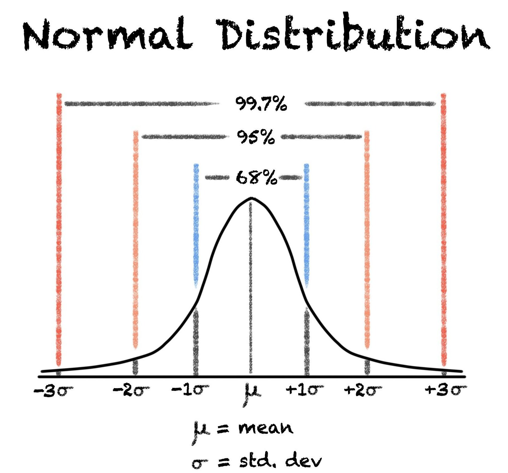

## The 68-95-99.7 rule

The 68-95-99.7 rule is based on the mean and standard deviation. It says:
> 1. 68% of the population is within 1 standard deviation of the mean.
> 2. 95% of the population is within 2 standard deviations of the mean.
> 3. 99.7% of the population is within 3 standard deviations of the mean.

