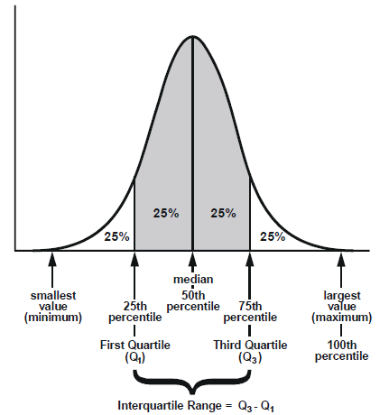

# Data Variability and Measurement Metrics

## 1. Interquartile Range (IQR)

**Definition:**
[
IQR = Q3 - Q1
]

* **Q1 (25th percentile)** = value below which 25% of data fall
* **Q3 (75th percentile)** = value below which 75% of data fall
* So IQR = spread of the **middle 50%** of the data

### Interpretation example
In Public Health context:
* If BMI IQR = 4 kg/m² → the middle half of participants vary by 4 units.
* It measures **dispersion without being affected by extreme values**.

It is a **robust measure of variability**.

---

## 2. Standard Deviation (SD)

**Definition (conceptually):**
Average distance of observations from the mean.

* Uses **all data points**
* Sensitive to **outliers**
* Best for **normally distributed data**

---

### Example for IQR and SD

Use a small dataset:

Data:
2, 4, 5, 7, 8, 9, 12

### Step 1: Median

Median = 7

### Step 2: Q1

Lower half: 2, 4, 5
Q1 = 4

### Step 3: Q3

Upper half: 8, 9, 12
Q3 = 9

[
IQR = 9 - 4 = 5
]

Then explain:

* IQR only uses the **middle 50%**
* The value 12 does not strongly affect IQR
* But 12 *will* increase SD

---

## 4. Link Between IQR and Standard Deviation (Most Important Part)

There is no general fixed relationship between IQR and SD.
They are only mathematically related if the data follow a normal distribution.

### Key Point:

They measure variability differently.

| IQR                  | Standard Deviation    |
| -------------------- | --------------------- |
| Uses quartiles       | Uses mean             |
| Robust to outliers   | Sensitive to outliers |
| Best for skewed data | Best for normal data  |
| Used with median     | Used with mean        |

---

## 5. Mathematical Relationship (ONLY if data are normal)

There is no general formula linking IQR and SD. They are only approximately related if the data are normally distributed. 
If data are **normally distributed**:

$$
IQR \approx 1.35 \times SD
$$

Or:

$$
SD \approx \frac{IQR}{1.35}
$$

### How so?
#### Step 1: Start With the Standard Normal Distribution

For a standard normal variable:

$$
Z \sim N(0,1)
$$

The probability between −a and +a is:

$$
P(-a < Z < a)
$$

Because of symmetry:

$$
P(-a < Z < a) = 2\Phi(a) - 1
$$

where
(\Phi(a)) = cumulative distribution function (CDF).

---

#### Step 2: Reproduce the 68% Rule Mathematically

We want:

$$
P(-1 < Z < 1)
$$

Using the formula:

$$
= 2\Phi(1) - 1
$$

From tables:

$$
\Phi(1) = 0.8413
$$

So:

$$
2(0.8413) - 1
$$

$$
= 1.6826 - 1
$$

$$
= 0.6826 \approx 68%
$$

That’s exactly where ±1 SD → 68% comes from.

---

#### Step 3: Now Do It for 50%

We now want to find **a** such that:

$$
P(-a < Z < a) = 0.50
$$

Using the same formula:

$$
2\Phi(a) - 1 = 0.50
$$

---

#### Step 4: Solve Algebraically

$$
2\Phi(a) - 1 = 0.50
$$

Add 1 to both sides:

$$
2\Phi(a) = 1.50
$$

Divide by 2:

$$
\Phi(a) = 0.75
$$

So we now need:

$$
a = \Phi^{-1}(0.75)
$$

Looking this up in a Z-table (or using software):

$$
a = 0.674
$$

---

#### Step 5: Final Result

$$
P(-0.674 < Z < 0.674) = 0.50
$$

That means:

* Q1 = −0.674 SD
* Q3 = +0.674 SD

So:

$$
IQR = 0.674 - (-0.674)
$$

$$
IQR = 1.349 SD
$$

$$
IQR \approx 1.35 SD
$$

---

# The Core Insight

Both:

* ±1 SD → 68%
* ±0.674 SD → 50%

come from solving the same probability equation:

$$
P(-a < Z < a) = desired\ percentage
$$

The only difference is the probability you plug in.

---

## 6. When Do We Use Each?

### Use Median + IQR when:

* Data are skewed (income, hospital stay length, waiting time)
* Small sample size
* Outliers present

### Use Mean + SD when:

* Data approximately normal
* Large epidemiological samples
* Parametric tests (t-test, ANOVA)

---

## In a nutshell:
> “Standard deviation tells us how far values spread around the mean.
> IQR tells us how wide the middle 50% of values are.
> SD is sensitive; IQR is robust.”

